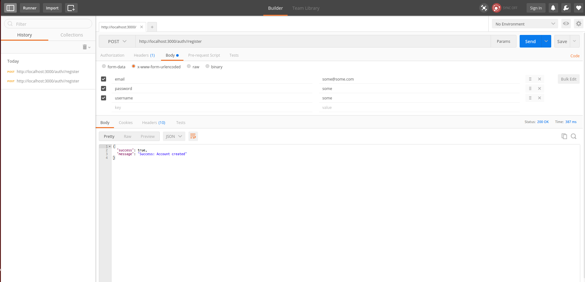
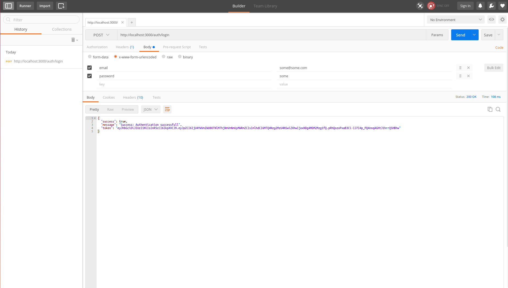

# node-jwt-demo

## What is JWT?
JWT stands for JSON Web Tokens, cool guys pronounce it as “jot”, for creating access tokens that assert some number of claims used for authenticating without any session overhead..
For more informtion [read] (https://tools.ietf.org/html/rfc7519)

## How it is different from traditional approach?
Since the HTTP protocol is stateless, tradition authentication maintains the session of logged user in server side and authenticate every requests with cookie data embedded in the header of the request.
As rise of the mobile application and webapps this method of authentication has serious issue on scalability.

JWT solves following issue of traditional approach.
- **Sessions** - Every time a user is authenticated, the server will need to create a record somewhere on our server. 
With increase in number of active users server will face huge memory overhead.
- **Scalability** - During autoscaling with demand replicating the entire instance will  having vital information in session memory will limit our ability to scale.
- **CORS** - With application running on multiple devices, we have to worry about cross-origin resource sharing (CORS). we could run into problems with forbidden requests if its not handled efficiently.
- **CSRF** - Need to take care protection against cross-site request forgery (CSRF) kind of attacks.

## How to use this?
Mongodb needs to be preinstalled on the system and Edit src/config/config_dev.js with appropriate information.

```bash
yarn install
gulp prepublish
node lib/index.js
```
## Verification using Postman?
1.User Registration


2.User Login


3.Accessing secured routes

